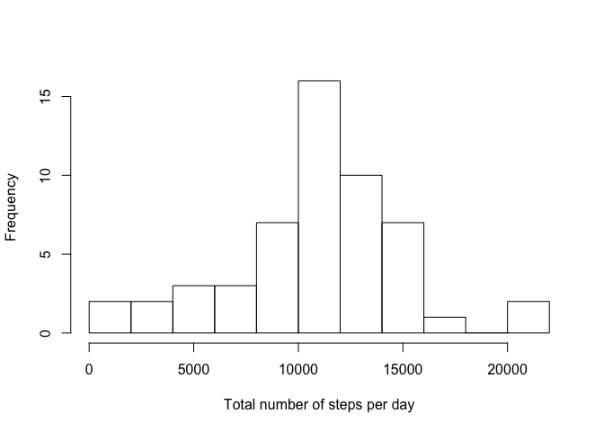
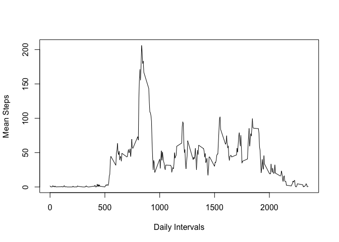
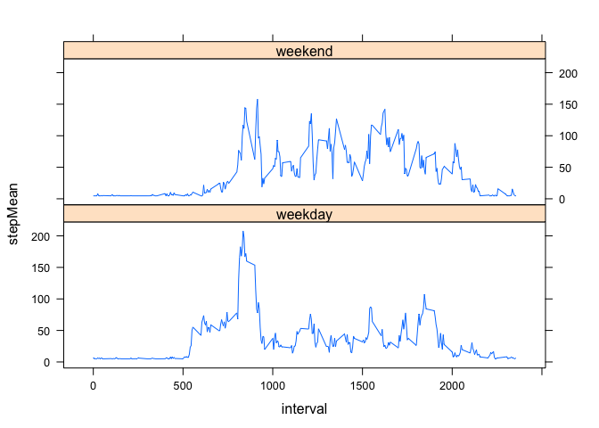

# Reproducible Research: Peer Assessment 1
---
output: html_document
---

##Introduction
It is now possible to collect a large amount of data about personal movement using activity monitoring devices such as a Fitbit, Nike Fuelband, or Jawbone Up. These type of devices are part of the “quantified self” movement – a group of enthusiasts who take measurements about themselves regularly to improve their health, to find patterns in their behavior, or because they are tech geeks. But these data remain under-utilized both because the raw data are hard to obtain and there is a lack of statistical methods and software for processing and interpreting the data.

This assignment makes use of data from a personal activity monitoring device. This device collects data at 5 minute intervals through out the day. The data consists of two months of data from an anonymous individual collected during the months of October and November, 2012 and include the number of steps taken in 5 minute intervals each day.
Set working directory and load data obtained from the Github Fork


##Data
The data for this assignment can be downloaded from the course web site:

Dataset: Activity monitoring data [52K]
The variables included in this dataset are:

 - steps: Number of steps taking in a 5-minute interval (missing values are coded as NA)

 - date: The date on which the measurement was taken in YYYY-MM-DD format

 - interval: Identifier for the 5-minute interval in which measurement was taken

The dataset is stored in a comma-separated-value (CSV) file and there are a total of 17,568 observations in this dataset.


##Loading and Cleaning Data


```r
setwd("~/datasciencecoursera/RepData_PeerAssessment1")
library (knitr)
library(plyr)

data <- read.table(unz("activity.zip", "activity.csv"), header=T, quote="\"", sep=",")

# convert date to date data type
data$date <- as.Date(data$date) 

summary(data)
```

```
##      steps             date               interval     
##  Min.   :  0.00   Min.   :2012-10-01   Min.   :   0.0  
##  1st Qu.:  0.00   1st Qu.:2012-10-16   1st Qu.: 588.8  
##  Median :  0.00   Median :2012-10-31   Median :1177.5  
##  Mean   : 37.38   Mean   :2012-10-31   Mean   :1177.5  
##  3rd Qu.: 12.00   3rd Qu.:2012-11-15   3rd Qu.:1766.2  
##  Max.   :806.00   Max.   :2012-11-30   Max.   :2355.0  
##  NA's   :2304
```


##Calculate mean and median steps per day


```r
data.ignore <- na.omit(data)

dailySteps <- rowsum(data.ignore$steps, format(data.ignore$date, '%Y-%m-%d'))
dailySteps <- data.frame(dailySteps)
names(dailySteps) <- ("steps") 
```

Plot a histogram of the total steps per day


```r
hist(dailySteps$steps,
     main = " ",
     breaks = 10,
     xlab = "Total number of steps per day")
```

 

Calculate mean and median per day


```r
mean(dailySteps$steps)
```

```
## [1] 10766.19
```

```r
median(dailySteps$steps)
```

```
## [1] 10765
```

## What is the average daily activity pattern?


```r
stepsInterval <- ddply (data,
                        .(interval), 
                        summarize, 
                        stepMean = mean(steps, na.rm=TRUE))
```

Plot line graph of the intervals


```r
plot (stepsInterval$interval, stepsInterval$stepMean, type='l', xlab='Daily Intervals', ylab='Mean Steps')
```

 


```r
stepsInterval[which.max(stepsInterval$stepMean), ]
```

```
##     interval stepMean
## 104      835 206.1698
```

###Which 5-minute interval, on average across all the days in the dataset, contains the maximum number of steps?
###The most active part of the day was around 8:35

##Imputing Missing Data

how many missing values are present in the data set?


```r
missing <- is.na(data$steps)
summary(missing)
```

```
##    Mode   FALSE    TRUE    NA's 
## logical   15264    2304       0
```

###Calculate and report the total number of missing values in the dataset (i.e. the total number of rows with NAs)
###There are 2304 missing data observartions

Fill in the missing data with the overall steps mean


```r
dataset <- data 
dataset[is.na(dataset)] <- 37.38
summary(dataset)
```

```
##      steps             date               interval     
##  Min.   :  0.00   Min.   :2012-10-01   Min.   :   0.0  
##  1st Qu.:  0.00   1st Qu.:2012-10-16   1st Qu.: 588.8  
##  Median :  0.00   Median :2012-10-31   Median :1177.5  
##  Mean   : 37.38   Mean   :2012-10-31   Mean   :1177.5  
##  3rd Qu.: 37.38   3rd Qu.:2012-11-15   3rd Qu.:1766.2  
##  Max.   :806.00   Max.   :2012-11-30   Max.   :2355.0
```


```r
dailySteps2 <- rowsum(dataset$steps, format(dataset$date, '%Y-%m-%d'))
dailySteps2 <- data.frame(dailySteps)
names(dailySteps2) <- ("steps") 
```

Plot a histogram of the total steps per day


```r
hist(dailySteps2$steps,
     main = " ",
     breaks = 10,
     xlab = "Total number of steps per day")
```

 

Calculate mean and median per day


```r
mean(dailySteps2$steps)
```

```
## [1] 10766.19
```

```r
median(dailySteps2$steps)
```

```
## [1] 10765
```

###What is the impact of imputing missing data on the estimates of the total daily number of steps?
###There is no change in the data

##Are there differences in activity patterns between weekdays and weekends?

First, seperate data between weekday and weekend


```r
weekdays <- weekdays(as.Date(dataset$date))
dataset$dayTypes <- factor (weekdays,
                          levels <- c ('weekday', 'weekend'))

dataset$dayTypes[] <- 'weekday'
dataset$dayTypes[weekdays %in% c ('Saturday', 'Sunday')] <- 'weekend'
```

Lastly, including the lattice library, transforms and plot the factor variables to determine if there is a difference


```r
library(lattice)

stepsInterval2 <- ddply (dataset,
                        .(interval, dayTypes), 
                        summarize, 
                        stepMean = mean(steps))


xyplot (stepMean ~ interval | dayTypes, 
        data=stepsInterval2,
        type='l',
        layout=c (1, 2))
```

 

###Conclusion, there is a difference between activity on weekdays versus weekends.  
